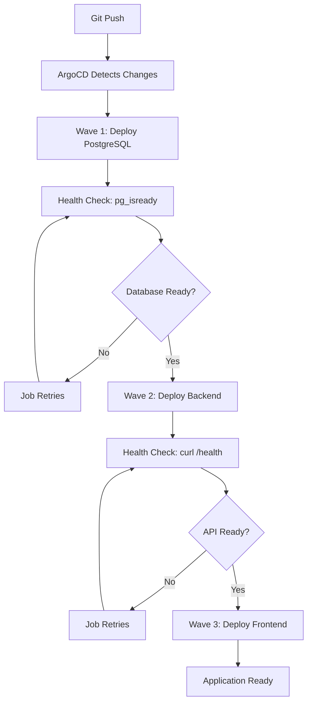

# ArgoCD Sync Waves with Health-Based Sequencing

This project demonstrates how to implement **resource-level sync waves** with **health validation jobs** to ensure proper deployment sequencing in a 3-tier application architecture.

## 🏗️ Architecture Overview

```
┌─────────────┐    ┌─────────────┐    ┌─────────────┐
│   Wave 1    │    │   Wave 2    │    │   Wave 3    │
│  PostgreSQL │───▶│   Backend   │───▶│  Frontend   │
│  Database   │    │    API      │    │    UI       │
└─────────────┘    └─────────────┘    └─────────────┘
       │                   │                   │
       ▼                   ▼                   ▼
┌─────────────┐    ┌─────────────┐    ┌─────────────┐
│Health Check │    │Health Check │    │   Ready     │
│   Job       │    │   Job       │    │             │
└─────────────┘    └─────────────┘    └─────────────┘
```

## 🌊 Sync Wave Strategy

We use **resource-level sync wave annotations** instead of ApplicationSet RollingSync for the following reasons:

### ✅ Why Resource-Level Sync Waves?

1. **Granular Control**: Each Kubernetes resource has its own wave number
2. **Health Validation**: Jobs can run between waves to validate dependencies
3. **Fine-Grained Sequencing**: Resources within an application can have different wave numbers
4. **Failure Isolation**: Failed health checks prevent higher waves from deploying

### ❌ Why NOT ApplicationSet RollingSync?

1. **Coarse-Grained**: Entire applications sync as units
2. **No Health Validation**: Applications sync regardless of dependency health
3. **Complex Configuration**: Requires matchExpressions and maxUpdate settings
4. **Limited Flexibility**: Can't handle intra-application dependencies

## 📋 Wave Configuration

### Wave 1: Database Layer
```yaml
# helm/postgres/templates/statefulset.yaml
metadata:
  annotations:
    argocd.argoproj.io/sync-wave: "1"
```
- **PostgreSQL StatefulSet**: Primary database
- **PostgreSQL Service**: Database connectivity

### Wave 1.5: Database Health Check
```yaml
# helm/todo-backend/templates/pre-sync-job.yaml  
metadata:
  annotations:
    argocd.argoproj.io/sync-wave: "1"
    argocd.argoproj.io/hook: PreSync
```
- **Health Check Job**: Validates PostgreSQL is accepting connections
- **Command**: `pg_isready -h postgres -p 5432`
- **Purpose**: Ensures backend only starts when database is ready

### Wave 2: API Layer
```yaml
# helm/todo-backend/templates/deployment.yaml
metadata:
  annotations:
    argocd.argoproj.io/sync-wave: "2"
```
- **Backend Deployment**: .NET API application
- **Backend Service**: API connectivity

### Wave 2.5: API Health Check
```yaml
# helm/todo-frontend/templates/pre-sync-job.yaml
metadata:
  annotations:
    argocd.argoproj.io/sync-wave: "2"
    argocd.argoproj.io/hook: PreSync
```
- **Health Check Job**: Validates Backend API is responding
- **Command**: `curl -f http://todo-api-service:80/health`
- **Purpose**: Ensures frontend only starts when API is ready

### Wave 3: Frontend Layer
```yaml
# helm/todo-frontend/templates/deployment.yaml
metadata:
  annotations:
    argocd.argoproj.io/sync-wave: "3"
```
- **Frontend Deployment**: Angular UI application
- **Frontend Service**: UI connectivity
- **Ingress**: External access

## 🔄 Deployment Flow



## 🛡️ Health Check Details

### PostgreSQL Health Check
```bash
# Checks database connectivity
until pg_isready -h postgres -p 5432; do
  echo "PostgreSQL is not ready yet... waiting 5 seconds"
  sleep 5
done
```

### Backend API Health Check
```bash
# Checks API health endpoint
until curl -f http://todo-api-service:80/health; do
  echo "Backend API is not ready yet... waiting 10 seconds"
  sleep 10
done
```

The `/health` endpoint includes:
- ✅ API responsiveness
- ✅ Database connectivity via EF Core
- ✅ Returns HTTP 200 (healthy) or 503 (unhealthy)

## 🎯 Benefits of This Approach

### 1. **Reliability**
- No race conditions between services
- Dependencies are validated before dependent services start
- Automatic retries for transient failures

### 2. **Visibility**
- Clear failure points in ArgoCD UI
- Job logs show exactly what's blocking deployment
- Health status is explicitly validated

### 3. **Simplicity**
- No complex ApplicationSet RollingSync configuration
- Standard Kubernetes Jobs for health validation
- Resource-level annotations are easy to understand

### 4. **Flexibility**
- Easy to add new dependencies
- Can handle complex dependency graphs
- Works with any application architecture

## 🚀 Key Advantages Over RollingSync

| Feature | Resource-Level Waves | ApplicationSet RollingSync |
|---------|---------------------|---------------------------|
| **Granularity** | Per-resource control | Per-application only |
| **Health Checks** | Built-in with Jobs | Not supported |
| **Configuration** | Simple annotations | Complex matchExpressions |
| **Debugging** | Clear job failures | Opaque sync failures |
| **Flexibility** | Handles any dependency | Limited to app-level deps |

## 📁 File Structure

```
helm/
├── postgres/
│   ├── templates/
│   │   ├── statefulset.yaml      # sync-wave: "1"
│   │   └── service.yaml          # sync-wave: "1"
│   └── values.yaml
├── todo-backend/
│   ├── templates/
│   │   ├── deployment.yaml       # sync-wave: "2"
│   │   ├── service.yaml          # sync-wave: "2"
│   │   └── pre-sync-job.yaml     # sync-wave: "1" (health check)
│   └── values.yaml
└── todo-frontend/
    ├── templates/
    │   ├── deployment.yaml        # sync-wave: "3"
    │   ├── service.yaml           # sync-wave: "3"
    │   ├── ingress.yaml           # sync-wave: "3"
    │   └── pre-sync-job.yaml      # sync-wave: "2" (health check)
    └── values.yaml
```

## 🔧 ApplicationSet Configuration

```yaml
apiVersion: argoproj.io/v1alpha1
kind: ApplicationSet
metadata:
  name: todo-app-apps
  namespace: argocd
spec:
  generators:
  - git:
      repoURL: https://github.com/FaresMirza/todo-app-devops
      revision: main
      files:
        - path: helm/*/config.yaml
  
  # No RollingSync strategy needed!
  # Resource-level sync waves handle sequencing
  
  template:
    metadata:
      name: "{{.app.name}}"
    spec:
      project: "{{.app.project}}"
      source:
        repoURL: https://github.com/FaresMirza/todo-app-devops
        targetRevision: main
        path: "{{.app.path}}"
      destination:
        server: https://kubernetes.default.svc
        namespace: "{{.app.namespace}}"
      syncPolicy:
        automated:
          prune: true
          selfHeal: true
        syncOptions:
          - CreateNamespace=true
          - ApplyOutOfSyncOnly=true
```

## 🧪 Testing Sync Waves

### Scenario 1: Normal Deployment
1. All services deploy in correct order (1→2→3)
2. Health checks pass at each stage
3. No failures or race conditions

### Scenario 2: Database Failure
1. PostgreSQL fails to start
2. Health check job fails in Wave 1
3. Backend never deploys (Wave 2 blocked)
4. Frontend never deploys (Wave 3 blocked)
5. Clear failure visibility in ArgoCD

### Scenario 3: API Failure
1. PostgreSQL deploys successfully (Wave 1)
2. Backend fails to start or become healthy
3. Health check job fails in Wave 2
4. Frontend never deploys (Wave 3 blocked)
5. Database remains available for debugging

## 📊 Monitoring and Observability

### ArgoCD UI
- Application sync status
- Resource health status
- Job execution logs
- Clear failure points

### Kubernetes Events
```bash
kubectl get events -n todo-app --sort-by='.firstTimestamp'
```

### Job Logs
```bash
kubectl logs -n todo-app job/wait-for-postgres-job
kubectl logs -n todo-app job/wait-for-backend-job
```

## 🔮 Future Enhancements

1. **Additional Health Checks**: Database schema validation, API endpoint testing
2. **Monitoring Integration**: Prometheus metrics for sync wave timing
3. **Notification Hooks**: Slack/Teams notifications for failed deployments
4. **Environment-Specific Waves**: Different wave timings for dev/staging/prod

## 📝 Conclusion

This approach provides **bulletproof deployment sequencing** by combining:
- 🌊 **Resource-level sync waves** for ordering
- 🏥 **Health check jobs** for validation  
- 🎯 **Simple configuration** without complex RollingSync
- 🛡️ **Reliable failure handling** with clear visibility

The result is a deployment system that **never fails due to dependency issues** and provides **clear feedback** when problems occur.